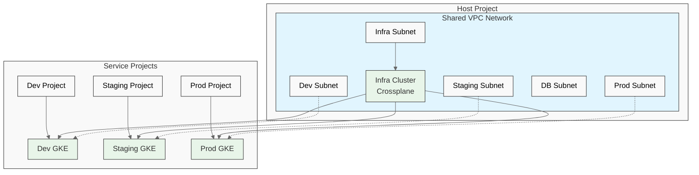
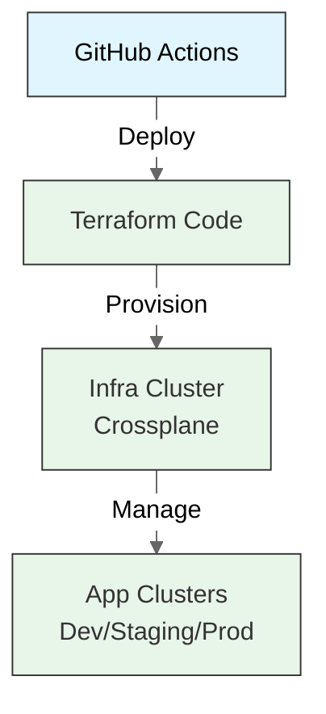

# Multi-Cluster Kubernetes Management Platform

> A modern Kubernetes infrastructure management solution for deploying and managing multiple GKE clusters across environments using Terraform, Crossplane, and GitHub Actions.

## Project Overview

This platform allows you to create a central infrastructure cluster that can provision and manage multiple application clusters across development, staging, and production environments. It uses a shared VPC architecture to provide secure networking with isolated subnets for each environment.

**Key Features:**
- Infrastructure-as-Code using Terraform
- Dynamic cluster provisioning using Crossplane
- CI/CD pipelines with GitHub Actions
- Secure networking with shared VPC
- Future database support built-in

## Architecture



### How It Works



### Components:

1. **Host Project (With Shared VPC)**
   - Contains the Shared VPC with separate subnets for:
     - Infrastructure (10.0.0.0/20)
     - Development (10.20.0.0/20)
     - Staging (10.40.0.0/20)
     - Production (10.60.0.0/20)
     - Database (10.80.0.0/20)

2. **Infrastructure Cluster**
   - Located in the Host Project
   - Runs Crossplane for managing application clusters
   - Provides centralized management

3. **Service Projects**
   - Dev, Staging, and Production projects
   - Each has its own application cluster
   - All use subnets from the shared VPC

4. **Application Clusters**
   - Located in their respective service projects
   - Run application workloads in isolated environments
   - Managed by Crossplane from the infrastructure cluster

## Getting Started

Follow these steps to deploy the platform:

### Prerequisites

- Google Cloud Platform account with organization-level access
- `gcloud` CLI installed and configured
- `kubectl` CLI installed
- `terraform` CLI installed
- `helm` CLI installed
- GitHub account for CI/CD pipelines

### Step 1: Set Up Google Cloud Projects

1. Create the required GCP projects:

```bash
# Create Host Project
gcloud projects create your-host-project-id --name="Infrastructure Host"

# Create Service Projects
gcloud projects create your-dev-project-id --name="Development"
gcloud projects create your-staging-project-id --name="Staging"
gcloud projects create your-prod-project-id --name="Production"
```

2. Run the setup script to configure project resources:

```bash
./scripts/setup.sh \
  --host-project your-host-project-id \
  --service-projects your-dev-project-id,your-staging-project-id,your-prod-project-id
```

### Step 2: Update Configuration Values

Edit the following files with your specific project information:

1. **Terraform Variables** (`infra/environments/dev/terraform.tfvars`):
   - Replace `your-gcp-project-id` with your host project ID
   - Replace `your-dev-project-id`, `your-staging-project-id`, and `your-prod-project-id` with your service project IDs
   - Update service account values in the `subnet_iam_bindings` section

2. **Terraform Backend** (`infra/environments/dev/backend.tf`):
   - Replace `your-terraform-state-bucket` with your GCS bucket name

3. **Crossplane Claims**:
   - Update project IDs in:
     - `crossplane/xresources/dev-gke-cluster-claim.yaml`
     - `crossplane/xresources/staging-gke-cluster-claim.yaml`
     - `crossplane/xresources/prod-gke-cluster-claim.yaml`

4. **Application Values** (`workloads/hello-world/values.yaml`):
   - Replace `gcr.io/your-gcp-project-id/hello-world` with your container registry path

### Step 3: Configure GitHub Secrets

Add these secrets to your GitHub repository:

- `GCP_HOST_PROJECT_ID`: Your host project ID
- `GCP_SA_KEY`: Base64-encoded service account key (output from setup script)
- `GCP_TERRAFORM_STATE_BUCKET`: GCS bucket name for Terraform state
- `GCP_DEV_PROJECT_ID`: Your development project ID
- `GCP_STAGING_PROJECT_ID`: Your staging project ID
- `GCP_PROD_PROJECT_ID`: Your production project ID

### Step 4: Deploy Infrastructure

1. Run the GitHub Action workflow to deploy the infrastructure:
   - Go to the Actions tab in your repository
   - Select the "Deploy Infrastructure" workflow
   - Click "Run workflow"

2. After infrastructure deployment completes, run the "Bootstrap Crossplane" workflow

3. Once Crossplane is ready, run the "Provision Dev Cluster" workflow

4. Finally, run the "Deploy Application" workflow to deploy the sample application

## Project Structure

```
CM-lab/
├── .github/workflows/                # CI/CD pipelines
│   ├── terraform-infra.yaml          # Deploy base infrastructure
│   ├── crossplane-bootstrap.yaml     # Set up Crossplane
│   ├── provision-dev-cluster.yaml    # Create application clusters
│   └── deploy-app.yaml               # Deploy sample application
├── infra/                            # Terraform infrastructure code
│   ├── modules/                      # Reusable modules
│   │   ├── vpc/                      # Networking & VPC
│   │   ├── gke/                      # GKE cluster
│   │   ├── iam/                      # IAM permissions
│   │   ├── apis/                     # GCP API enablement
│   │   └── container-registry/       # Container Registry
│   └── environments/
│       └── dev/                      # Infrastructure configuration
├── crossplane/                       # Crossplane resources
│   ├── bootstrap/                    # Initial setup
│   ├── compositions/                 # Resource templates
│   └── xresources/                   # Cluster definitions and claims
├── kubernetes-addons/                # Cluster add-ons
│   ├── cert-manager/                 # TLS certificates
│   ├── ingress-nginx/                # Ingress controller
│   ├── reloader/                     # Config reload
│   └── secret-manager/               # Secret management
├── workloads/
│   └── hello-world/                  # Sample application
└── scripts/                          # Utility scripts
```

## Architecture Details

### 1. Infracluster (GKE in Host Project)

- **Purpose**: Centralized management cluster
- **Configuration**:
  - Regional cluster with 1-3 nodes
  - Machine type: e2-standard-2
  - Runs Crossplane for application cluster management
  - Located in the infrastructure subnet

### 2. Application Clusters (Service Projects)

Each environment has its own dedicated GKE cluster:

| Environment | Type | Machine Type | Node Count | Purpose |
|-------------|------|-------------|------------|---------|
| Development | Zonal | e2-standard-2 | 1-3 | Feature development and testing |
| Staging | Regional | e2-standard-2 | 2-5 | Pre-production validation |
| Production | Regional | e2-standard-4 | 3-7 | Production workloads |

### 3. Networking

The shared VPC is configured with these subnets:

```
Shared VPC Network (10.0.0.0/8)
│
├── 10.0.0.0/20    - Infra Subnet      - For Infracluster
│   ├── 10.16.0.0/16  - Pod CIDR         - For Infracluster Pods
│   └── 10.17.0.0/20  - Service CIDR     - For Infracluster Services
│
├── 10.20.0.0/20   - Dev Subnet        - For Dev Cluster
│   ├── 10.32.0.0/16  - Pod CIDR         - For Dev Pods
│   └── 10.33.0.0/20  - Service CIDR     - For Dev Services  
│
├── 10.40.0.0/20   - Staging Subnet    - For Staging Cluster
│   ├── 10.48.0.0/16  - Pod CIDR         - For Staging Pods
│   └── 10.49.0.0/20  - Service CIDR     - For Staging Services
│
├── 10.60.0.0/20   - Prod Subnet       - For Prod Cluster
│   ├── 10.64.0.0/16  - Pod CIDR         - For Prod Pods
│   └── 10.65.0.0/20  - Service CIDR     - For Prod Services
│
├── 10.80.0.0/20   - DB Subnet         - For Future Databases
│
└── 10.0.16.0/22   - Proxy Subnet      - For External Services
```

This carefully planned IP address allocation ensures no conflicts between environments.

## Advanced Features

### Database Integration

The platform includes a reserved subnet for future database deployments. This enables:

- Cloud SQL instances with private connectivity
- Redis/Memcached for caching
- MongoDB Atlas with private endpoint access
- Any other database service that can connect via VPC

To add a database, simply deploy it to the database subnet (10.80.0.0/20) and configure the appropriate firewall rules.

### Kubernetes Add-ons

All application clusters include these pre-configured add-ons:

1. **NGINX Ingress Controller**
   - Manages incoming traffic to applications
   - Provides load balancing and routing

2. **cert-manager**
   - Automates TLS certificate management
   - Integrates with Let's Encrypt for free certificates

3. **Reloader**
   - Automatically restarts pods when configs change
   - No manual intervention needed for updates

4. **External Secrets Operator**
   - Integrates with GCP Secret Manager
   - Securely provides secrets to applications

### Scaling Up

To add additional clusters to an environment:

1. Create a new Crossplane claim file (copy an existing one)
2. Update the cluster name and other parameters as needed
3. Apply the claim using kubectl or the CI/CD pipeline

The architecture supports unlimited clusters without any networking constraints.

## Troubleshooting

### Common Infrastructure Issues

| Problem | Solution |
|---------|----------|
| **Terraform errors** | Check that your GCP service account has the required permissions and that all placeholders in terraform.tfvars are replaced |
| **VPC setup issues** | Verify service project attachment with `gcloud compute shared-vpc get-host-project SERVICE_PROJECT_ID` |
| **Cluster creation fails** | Check Crossplane logs with `kubectl logs -l app=crossplane -n crossplane-system` |
| **Network connectivity** | Verify subnet IAM bindings with `gcloud projects get-iam-policy HOST_PROJECT_ID --format=json \| grep compute.subnetworks.use` |

### Validating Your Deployment

After completing all the steps, validate that everything is working:

```bash
# Check infracluster is running
gcloud container clusters list --project=your-host-project-id

# Verify Crossplane installation
kubectl --context=infracluster get providers

# List application clusters created by Crossplane
kubectl --context=infracluster get gkecluster.platform.commercelab.io

# Connect to dev cluster
gcloud container clusters get-credentials dev-gke-cluster \
  --project=your-dev-project-id --region=us-central1

# Check deployed application
kubectl get pods -n default
```

## Cleanup

To remove all resources when you're done:

```bash
./scripts/cleanup.sh \
  --host-project your-host-project-id \
  --service-projects your-dev-project-id,your-staging-project-id,your-prod-project-id
```

## Contributing

Contributions are welcome! Please feel free to submit a Pull Request.

## License

This project is licensed under the MIT License - see the LICENSE file for details.