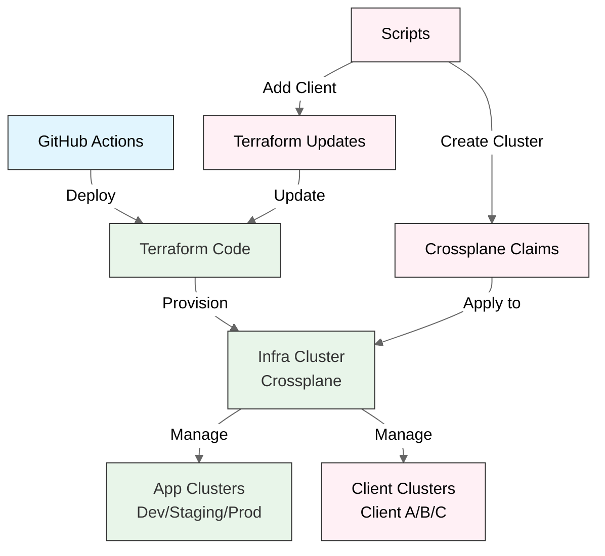

# Multi-Cluster Kubernetes Management Platform

> A modern Kubernetes infrastructure management solution for deploying and managing multiple GKE clusters across environments using Terraform, Crossplane, and GitHub Actions.

## Project Overview

This platform allows you to create a central infrastructure cluster that can provision and manage multiple application clusters across development, staging, and production environments. It uses a shared VPC architecture to provide secure networking with isolated subnets for each environment.

**Key Features:**
- Infrastructure-as-Code using Terraform
- Dynamic cluster provisioning using Crossplane
- CI/CD pipelines with GitHub Actions
- Secure networking with shared VPC
- Future database support built-in

## Architecture


### How It Works



### Components:

1. **Host Project (With Shared VPC)**
   - Contains the Shared VPC with separate subnets for:
     - Infrastructure (10.0.0.0/20)
     - Development (10.20.0.0/20)
     - Staging (10.40.0.0/20)
     - Production (10.60.0.0/20)
     - Client-specific subnets (10.X.0.0/20) - Dynamically allocated
     - Database (10.80.0.0/20)

2. **Infrastructure Cluster**
   - Located in the Host Project
   - Runs Crossplane for managing application clusters
   - Provides centralized management for both internal and client clusters
   - Handles cluster lifecycle for all environments

3. **Service Projects**
   - Dev, Staging, and Production projects (internal environments)
   - Client-specific projects (B2B environments)
   - Each has its own application cluster
   - All use subnets from the shared VPC with proper IAM bindings

4. **Application Clusters**
   - Located in their respective service projects
   - Run application workloads in isolated environments
   - Managed by Crossplane from the infrastructure cluster

5. **Client Clusters**
   - Dedicated GKE clusters for B2B clients
   - Complete isolation between clients
   - Custom API enablement per client
   - Flexible resource allocation based on client needs
   - Created using automated scripts for consistency

## Getting Started

Follow these steps to deploy the platform:

### Prerequisites

- Google Cloud Platform account with organization-level access
- `gcloud` CLI installed and configured
- `kubectl` CLI installed
- `terraform` CLI installed
- `helm` CLI installed
- GitHub account for CI/CD pipelines

### Step 1: Set Up Google Cloud Projects

1. Create the required GCP projects:

```bash
# Create Host Project
gcloud projects create your-host-project-id --name="Infrastructure Host"

# Create Service Projects
gcloud projects create your-dev-project-id --name="Development"
gcloud projects create your-staging-project-id --name="Staging"
gcloud projects create your-prod-project-id --name="Production"
```

2. Run the setup script to configure project resources:

```bash
./scripts/setup.sh \
  --host-project your-host-project-id \
  --service-projects your-dev-project-id,your-staging-project-id,your-prod-project-id
```

### Step 2: Update Configuration Values

Edit the following files with your specific project information:

1. **Terraform Variables** (`infra/environments/dev/terraform.tfvars`):
   - Replace `your-gcp-project-id` with your host project ID
   - Replace `your-dev-project-id`, `your-staging-project-id`, and `your-prod-project-id` with your service project IDs
   - Update service account values in the `subnet_iam_bindings` section

2. **Terraform Backend** (`infra/environments/dev/backend.tf`):
   - Replace `your-terraform-state-bucket` with your GCS bucket name

3. **Crossplane Claims**:
   - Update project IDs in:
     - `crossplane/xresources/dev-gke-cluster-claim.yaml`
     - `crossplane/xresources/staging-gke-cluster-claim.yaml`
     - `crossplane/xresources/prod-gke-cluster-claim.yaml`

4. **Application Values** (`workloads/hello-world/values.yaml`):
   - Replace `gcr.io/your-gcp-project-id/hello-world` with your container registry path

### Step 3: Configure GitHub Secrets

Add these secrets to your GitHub repository:

- `GCP_HOST_PROJECT_ID`: Your host project ID
- `GCP_SA_KEY`: Base64-encoded service account key (output from setup script)
- `GCP_TERRAFORM_STATE_BUCKET`: GCS bucket name for Terraform state
- `GCP_DEV_PROJECT_ID`: Your development project ID
- `GCP_STAGING_PROJECT_ID`: Your staging project ID
- `GCP_PROD_PROJECT_ID`: Your production project ID

### Step 4: Deploy Infrastructure

1. Run the GitHub Action workflow to deploy the infrastructure:
   - Go to the Actions tab in your repository
   - Select the "Deploy Infrastructure" workflow
   - Click "Run workflow"

2. After infrastructure deployment completes, run the "Bootstrap Crossplane" workflow

3. Once Crossplane is ready, run the "Provision Dev Cluster" workflow

4. Finally, run the "Deploy Application" workflow to deploy the sample application

## Project Structure

```
CM-lab/
├── .github/workflows/                # CI/CD pipelines
│   ├── terraform-infra.yaml          # Deploy base infrastructure
│   ├── crossplane-bootstrap.yaml     # Set up Crossplane
│   ├── provision-dev-cluster.yaml    # Create application clusters
│   └── deploy-app.yaml               # Deploy sample application
├── infra/                            # Terraform infrastructure code
│   ├── modules/                      # Reusable modules
│   │   ├── vpc/                      # Networking & VPC
│   │   ├── gke/                      # GKE cluster
│   │   ├── iam/                      # IAM permissions
│   │   ├── apis/                     # GCP API enablement (customizable per env)
│   │   └── container-registry/       # Container Registry
│   └── environments/
│       └── dev/                      # Infrastructure configuration
├── crossplane/                       # Crossplane resources
│   ├── bootstrap/                    # Initial setup
│   ├── compositions/                 # Resource templates
│   └── xresources/                   # Cluster definitions and claims
│       ├── dev-gke-cluster-claim.yaml        # Development environment
│       ├── staging-gke-cluster-claim.yaml    # Staging environment
│       ├── prod-gke-cluster-claim.yaml       # Production environment
│       └── client-gke-cluster-template.yaml  # Template for client clusters
├── kubernetes-addons/                # Cluster add-ons
│   ├── cert-manager/                 # TLS certificates
│   ├── ingress-nginx/                # Ingress controller
│   ├── reloader/                     # Config reload
│   └── secret-manager/               # Secret management
├── workloads/
│   └── hello-world/                  # Sample application
└── scripts/                          # Utility scripts
    ├── setup.sh                      # Platform setup script
    ├── cleanup.sh                    # Platform cleanup script
    ├── install-cluster-addons.sh     # Install Kubernetes add-ons (script-based)
    ├── install-addons-gitops.sh      # Install Kubernetes add-ons (GitOps-based)
    ├── add-client-subnet.sh          # Add subnet for new client
    └── create-client-cluster.sh      # Create client-specific cluster
```

## Architecture Details

### 1. Infracluster (GKE in Host Project)

- **Purpose**: Centralized management cluster
- **Configuration**:
  - Regional cluster with 1-3 nodes
  - Machine type: e2-standard-2
  - Runs Crossplane for application cluster management
  - Located in the infrastructure subnet

### 2. Application Clusters (Service Projects)

Each environment has its own dedicated GKE cluster:

| Environment | Type | Machine Type | Node Count | Purpose |
|-------------|------|-------------|------------|---------|
| Development | Zonal | e2-standard-2 | 1-3 | Feature development and testing |
| Staging | Regional | e2-standard-2 | 2-5 | Pre-production validation |
| Production | Regional | e2-standard-4 | 3-7 | Production workloads |

### 3. Networking

The shared VPC is configured with these subnets:

```
Shared VPC Network (10.0.0.0/8)
│
├── 10.0.0.0/20    - Infra Subnet      - For Infracluster
│   ├── 10.16.0.0/16  - Pod CIDR         - For Infracluster Pods
│   └── 10.17.0.0/20  - Service CIDR     - For Infracluster Services
│
├── 10.20.0.0/20   - Dev Subnet        - For Dev Cluster
│   ├── 10.32.0.0/16  - Pod CIDR         - For Dev Pods
│   └── 10.33.0.0/20  - Service CIDR     - For Dev Services  
│
├── 10.40.0.0/20   - Staging Subnet    - For Staging Cluster
│   ├── 10.48.0.0/16  - Pod CIDR         - For Staging Pods
│   └── 10.49.0.0/20  - Service CIDR     - For Staging Services
│
├── 10.60.0.0/20   - Prod Subnet       - For Prod Cluster
│   ├── 10.64.0.0/16  - Pod CIDR         - For Prod Pods
│   └── 10.65.0.0/20  - Service CIDR     - For Prod Services
│
├── 10.80.0.0/20   - DB Subnet         - For Future Databases
│
└── 10.0.16.0/22   - Proxy Subnet      - For External Services
```

This carefully planned IP address allocation ensures no conflicts between environments.

## Advanced Features

### Multi-Client B2B Deployment

The platform provides flexible B2B capabilities for deploying dedicated client environments:

1. **Client Onboarding Process**:
   - Use `scripts/add-client-subnet.sh` to add a dedicated subnet for the client
   - Use `scripts/create-client-cluster.sh` to provision a client-specific GKE cluster
   - Each client gets isolated infrastructure with shared management

2. **Client-Specific Customization**:
   - API enablement can be customized for each client/environment
   - Infrastructure sizing adjusts based on client requirements
   - Security policies can be tailored to client compliance needs

3. **Resource Isolation**:
   - Each client has dedicated subnet in the shared VPC
   - Workloads run in separate GKE clusters with network isolation
   - Firewall rules can be customized for each client

This architecture allows service providers to easily onboard new clients with complete infrastructure isolation while maintaining centralized management.

### Database Integration

The platform includes a reserved subnet for future database deployments. This enables:

- Cloud SQL instances with private connectivity
- Redis/Memcached for caching
- MongoDB Atlas with private endpoint access
- Any other database service that can connect via VPC

To add a database, simply deploy it to the database subnet (10.80.0.0/20) and configure the appropriate firewall rules.

### Kubernetes Add-ons

All application clusters include these pre-configured add-ons with flexible installation options:

1. **NGINX Ingress Controller**
   - Manages incoming traffic to applications
   - Provides load balancing and routing
   - Auto-configures with Let's Encrypt for TLS
   - High-performance ingress with custom annotations support

2. **cert-manager with Let's Encrypt Integration**
   - Automates TLS certificate management
   - Integrates with Let's Encrypt for free certificates
   - Handles certificate renewal and rotation automatically
   - Configured with ClusterIssuers for production and staging
   - Automatic HTTP-01 challenge resolution via NGINX Ingress
   - Zero-touch certificate management with auto-renewal before expiration
   - Certificate status monitoring via Prometheus metrics

3. **Reloader**
   - Automatically restarts pods when configs change
   - No manual intervention needed for updates
   - Monitors configmaps and secrets for changes
   - Supports annotation-based configuration

4. **External Secrets Operator**
   - Integrates with GCP Secret Manager
   - Securely provides secrets to applications
   - Handles automatic rotation of credentials
   - Centralized secrets management with versioning

5. **Prometheus & Grafana Stack**
   - Comprehensive monitoring solution with preconfigured alerts
   - Pre-configured dashboards for GKE monitoring and application metrics
   - Alert management with configurable notification channels
   - Built-in visualization of cluster metrics
   - Long-term metrics storage with optimized retention policies

6. **Kyverno Policy Management**
   - Kubernetes-native policy engine
   - Enforces security best practices
   - Automatically applies network policies
   - Resource quota enforcement
   - Validates security contexts and pod configurations

7. **Istio Service Mesh**
   - Advanced traffic management with fine-grained routing
   - Comprehensive observability and distributed tracing
   - Security features including mTLS between services
   - API gateway capabilities with JWT validation
   - Circuit breaking and fault injection for resilience testing

8. **Velero Backup Solution**
   - Automated cluster backups with configurable schedules
   - Point-in-time disaster recovery capabilities
   - Scheduled backups to GCS buckets with retention policies
   - Application-consistent backups with hooks
   - Selective restore options for granular recovery

9. **ExternalDNS**
   - Automatic DNS management for services and ingresses
   - Integrates with Google Cloud DNS
   - Synchronizes Kubernetes resources with DNS records
   - Supports multiple DNS providers
   - Annotated-based configuration for fine-grained control

#### Certificate Management with Let's Encrypt

The platform uses cert-manager with Let's Encrypt for automated certificate management:

1. **Production and Staging Issuers**
   - `letsencrypt-prod`: For production certificates (rate-limited)
   - `letsencrypt-staging`: For testing without hitting rate limits

2. **Automatic HTTP-01 Challenge Resolution**
   - NGINX Ingress Controller automatically handles challenge requests
   - No manual DNS configuration needed for validation

3. **Certificate Request Process**
   ```yaml
   apiVersion: networking.k8s.io/v1
   kind: Ingress
   metadata:
     name: example-ingress
     annotations:
       cert-manager.io/cluster-issuer: "letsencrypt-prod"
   spec:
     tls:
     - hosts:
       - example.com
       secretName: example-tls
     rules:
     - host: example.com
       http:
         paths:
         - path: /
           pathType: Prefix
           backend:
             service:
               name: example-service
               port:
                 number: 80
   ```

4. **Certificate Renewal**
   - Automatic renewal when certificates approach expiration
   - Certificates are renewed 30 days before expiration
   - Zero-downtime certificate rotation

#### Add-on Installation Methods

The platform supports multiple methods for installing Kubernetes add-ons:

1. **Interactive Menu-Based Installation**
   - New enhanced installation script with interactive menu
   - Choose specific add-ons based on your needs
   - Install all add-ons at once or select specific categories
   - Fully automated setup with proper configurations
   - Run with `./kubernetes-addons/install.sh`

2. **GitOps with ArgoCD/Flux**
   - Recommended approach for production environments
   - Add-ons defined as Helm charts or Kustomize manifests in Git
   - Automated synchronization from Git repository
   - Full audit trail and version control
   - Install ArgoCD with `./scripts/install-addons-gitops.sh`

3. **Helm Charts via CI/CD**
   - Add-ons installed during cluster provisioning
   - Helm charts applied via GitHub Actions
   - Version pinning and dependency management
   - Easy upgrades through CI/CD pipelines
   - Integrated with infrastructure provisioning

4. **Category-Based Add-ons**
   - Choose add-ons by category:
     - **Essential**: NGINX Ingress, cert-manager, Reloader, External Secrets
     - **Monitoring**: Prometheus Stack with Grafana dashboards
     - **Security**: Kyverno Policy Management
     - **Backup**: Velero for backups and recovery
     - **Service Mesh**: Istio for advanced networking
     - **DNS Management**: ExternalDNS for automatic DNS configuration

### Scaling Up

To add additional clusters to an environment:

1. **For standard environments (dev/staging/prod)**:
   - Create a new Crossplane claim file (copy an existing one)
   - Update the cluster name and other parameters as needed
   - Apply the claim using kubectl or the CI/CD pipeline

2. **For client-specific environments**:
   - Use the provided scripts for easy client onboarding:
     ```bash
     # Add a dedicated subnet for the client
     ./scripts/add-client-subnet.sh
     
     # Provision a client-specific GKE cluster
     ./scripts/create-client-cluster.sh
     ```

The architecture supports unlimited clusters without any networking constraints.

## B2B Client Onboarding

The platform is designed to easily onboard new B2B clients with dedicated infrastructure. Here's how to set up a new client:

### 1. Add Client Subnet to Shared VPC

First, run the add-client-subnet script to create a dedicated subnet for the client:

```bash
./scripts/add-client-subnet.sh
```

This script will:
- Create a new subnet in the shared VPC with dedicated IP ranges
- Add the necessary IAM bindings for the client project
- Update the Terraform configuration

After running the script, apply the Terraform changes:

```bash
cd infra/environments/dev
terraform plan
terraform apply
```

### 2. Provision Client-Specific GKE Cluster

Once the subnet is ready, create a dedicated GKE cluster for the client:

```bash
./scripts/create-client-cluster.sh
```

This script will:
- Generate a custom Crossplane claim for the client
- Apply the claim to provision a new GKE cluster
- Configure the cluster with client-specific settings

### 3. Configure Client Cluster

After the cluster is provisioned, install the necessary add-ons:

```bash
# Connect to the client cluster
gcloud container clusters get-credentials client-name-gke-cluster \
  --project=client-project-id --region=us-central1

# Install cluster add-ons
./scripts/install-cluster-addons.sh

# For production environments, use GitOps-based installation
./scripts/install-addons-gitops.sh
```

### 4. Deploy Client Applications

Finally, deploy the client's applications to their dedicated cluster:

```bash
# Deploy client application using Helm
helm upgrade --install client-app ./workloads/hello-world \
  --namespace default \
  --set environment=production \
  --set client=client-name
```

## Troubleshooting

### Common Infrastructure Issues

| Problem | Solution |
|---------|----------|
| **Terraform errors** | Check that your GCP service account has the required permissions and that all placeholders in terraform.tfvars are replaced |
| **VPC setup issues** | Verify service project attachment with `gcloud compute shared-vpc get-host-project SERVICE_PROJECT_ID` |
| **Cluster creation fails** | Check Crossplane logs with `kubectl logs -l app=crossplane -n crossplane-system` |
| **Network connectivity** | Verify subnet IAM bindings with `gcloud projects get-iam-policy HOST_PROJECT_ID --format=json \| grep compute.subnetworks.use` |
| **Client cluster issues** | Check client subnet configuration in terraform.tfvars and ensure client project has proper IAM permissions |

### Validating Your Deployment

After completing all the steps, validate that everything is working:

```bash
# Check infracluster is running
gcloud container clusters list --project=your-host-project-id

# Verify Crossplane installation
kubectl --context=infracluster get providers

# List all clusters created by Crossplane (including client clusters)
kubectl --context=infracluster get gkecluster.platform.commercelab.io

# Connect to a client cluster
gcloud container clusters get-credentials client-name-gke-cluster \
  --project=client-project-id --region=us-central1

# Check deployed applications
kubectl get pods -n default
```

## Cleanup

To remove all resources when you're done:

```bash
./scripts/cleanup.sh \
  --host-project your-host-project-id \
  --service-projects your-dev-project-id,your-staging-project-id,your-prod-project-id
```

## Contributing

Contributions are welcome! Please feel free to submit a Pull Request.

## License

This project is licensed under the MIT License - see the LICENSE file for details.